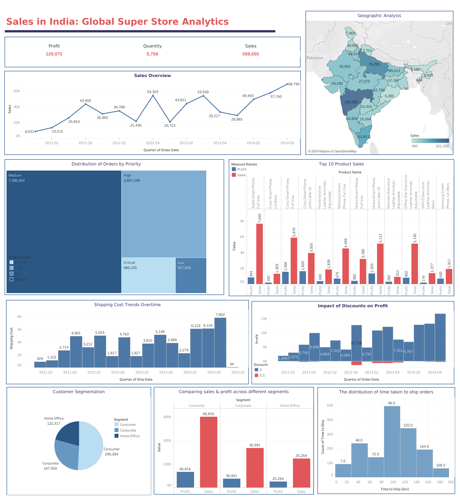

# Sales_Analysis_Using_Tablaeu
Dataset Link : https://www.kaggle.com/datasets/apoorvaappz/global-super-store-dataset

Link : https://public.tableau.com/views/SalesInIndia/SalesInIndia?:language=en-US&publish=yes&:display_count=n&:origin=viz_share_link

## The key findings:
The dataset on sales in India for a Global Super store reveals significant insights. 
- India's overall sales metrics showcase a profit of 129,072, quantity of 5,758, and total sales amounting to 589,650.
- Notable peaks and troughs in sales occurred during specific quarters, with Maharashtra and Uttar Pradesh emerging as the states with the highest sales.
- Order priorities are predominantly medium, followed by high, critical, and low.
- The top-selling product is the "iPhone Full Size," while the "SAFO Executive Leather Armchair" generates the highest profit.
- Shipping costs exhibit a noteworthy drop in 2015 Q2, and negative discounts are observed for a 0.5 value.
- Consumer dominance in customer segmentation is evident, followed by the corporate segment, while the home office segment is the smallest.
- Comparing sales and profit across segments reveals that the Consumer segment leads in sales, while all three segments show similar profit levels.
- Lastly, the majority of orders are shipped within the 96 to 120-hour timeframe, providing a comprehensive overview of the sales landscape and associated dynamics.
